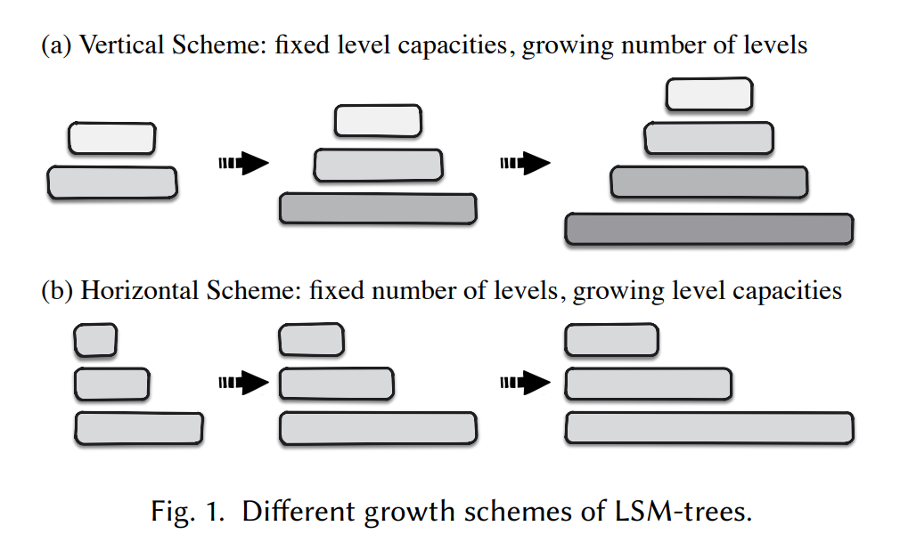
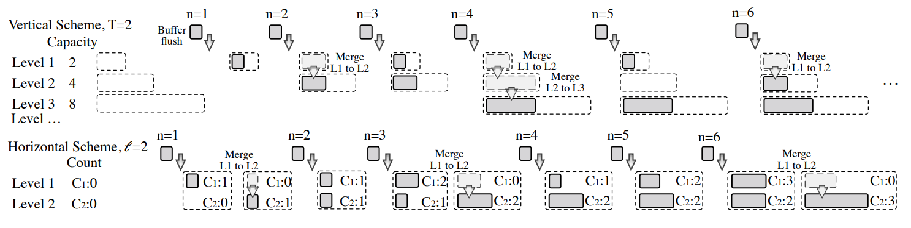

## About LSM-tree level size
## -  How to Grow an LSM-tree? Towards Bridging the Gap Between Theory and Practice

The LSM-tree grows with data ingestion, by either adding levels with fixed level capacities (dubbed as vertical scheme) or increasing level capacities with fixed number of levels (dubbed as horizontal scheme).

- Leveling: Each level maintains only one sorted run, so incoming data must be compacted and merged with existing data immediately.

- Tiering:  Each level can have multiple sorted runs, so incoming data is simply appended without immediate merging.

## Read-Modify-Write
## - Enhancing LSM-Tree Key-Value Stores for Read-Modify-Writes via Key-Delta Separation
A read-modify-write (RMW) logically reads a KV pair from the LSM-tree to memory, modifies the value in memory, and writes the modified KV pair back to the LSM-tree. We discuss two RMW approaches, namely Get-Put and Merge.
